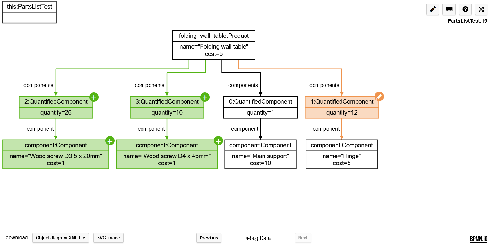

[](https://github.com/timKraeuter/object-diagram-js/actions/workflows/ci.yml)

## [Try the resulting object diagram modeler here](https://timkraeuter.com/object-diagram-js/).

## Object-diagram-js

This repository contains the source code for **object-diagram-js**, based on **diagram-js** and strongly inspired by the excellent **bpmn-js**.
A demonstration is available [here](https://timkraeuter.com/object-diagram-js/).

### Usage

The project is published as a [npm package](https://www.npmjs.com/package/object-diagram-modeler).
Usage is similar to [bpmn-js](https://github.com/bpmn-io/bpmn-js) and is shown in `/starter`.

### Installing dependencies

```console
npm i
cd starter
npm i
```

### Running the modeler

```console
cd starter
npm start
```

### Build & deploy changes to github-pages

```console
cd starter
npm run build:github-pages
```

## Object-diagram-js debugger

The UI used in the [visual debugger IntelliJ plugin](https://plugins.jetbrains.com/plugin/16851-visual-debugger) is configured in the folder `/debugger`.
This serves as an example how the library can be used and customized (here we added a **Websocket connection** to read debug data live).
The debugger has two more interesting features:

1. The debugger **highlights changes** by computing a diff using [object-diagram-js-differ](https://github.com/timKraeuter/object-diagram-js-differ):
   

2. The debugger saves the **debugging history** such that a user can step back in the UI:
   

### Installing dependencies

```console
npm i
cd starter
npm i
```

### Running the debugger

```console
cd starter
npm run startDebugger
```

### Building the debugger

```console
cd starter
npm run buildDebugger:deploy
```

The debugger will be build at the right location for the **visual debugger plugin**.

## License

MIT

Contains parts of ([bpmn-io](https://github.com/bpmn-io)) released under the [bpmn.io license](http://bpmn.io/license).

## Acknowledgments

I used the excellent [postit-js](https://github.com/pinussilvestrus/postit-js) example as a starting point for my project.
